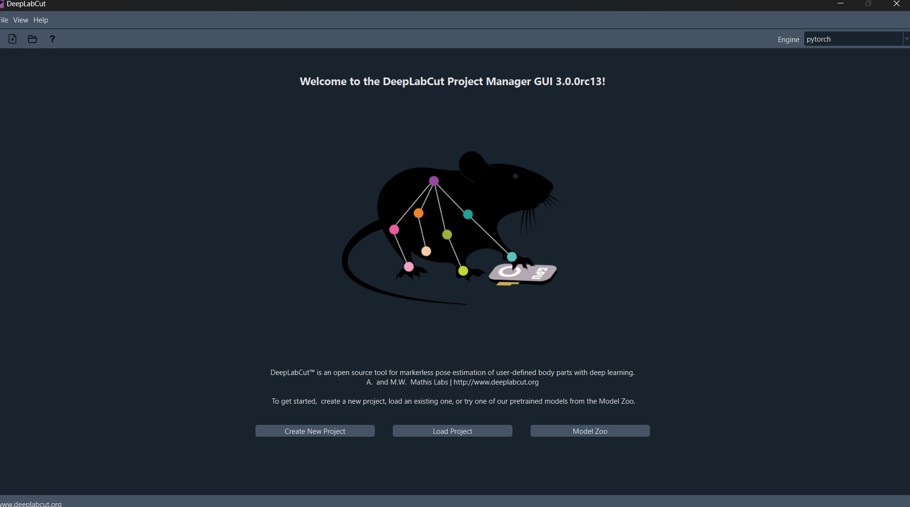
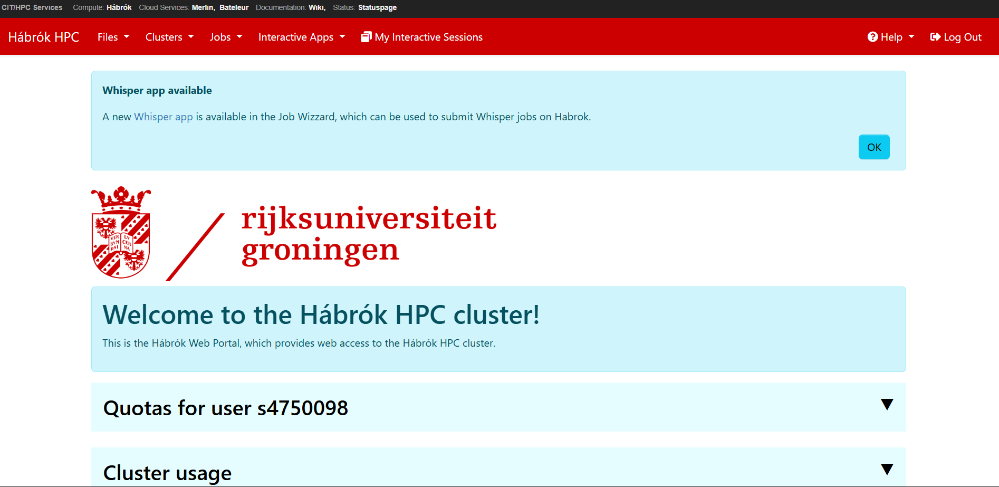
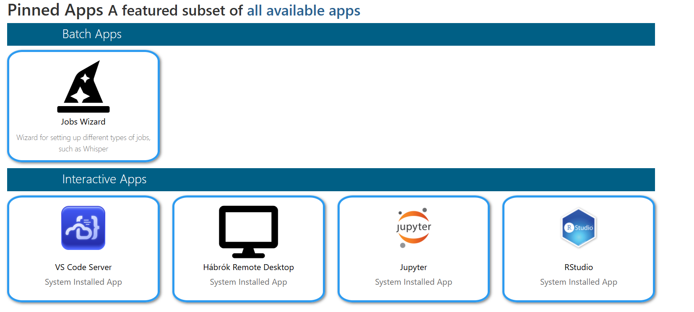

# Deeplabcut Tips & Tricks

Firstly, it is recommended to read up on the usage of DeepLabCut directly from their own [**Beginner's Guide**](https://github.com/DeepLabCut/DeepLabCut/blob/main/docs/beginner-guides/beginners-guide.md). 
They did a phenomenal job explaining how to get started and share all of their own insights as well, in their [**./docs**](https://github.com/DeepLabCut/DeepLabCut/tree/main/docs) section. This also includes a [**interactive course**](https://github.com/DeepLabCut/DeepLabCut/blob/main/docs/course.md) on how to use their software. 

> [!Tip]
> Youtube is also a great source of information for  visual explanations. For more niche cases, stackoverflow and similar coding forums, are the way to go. There is a large community of people available to answer your specific questions. Additionally, I'm available at j.ten.broeke.1@student.rug.nl for any questions you might have. 

## __DeepLabCut Setup__
To set up DeepLabCut you will first need to acquire a conda environment.
To do this open your terminal in your preferred code compiler, navigate to your folder location and use;
```bash
pip install conda
```

Then you want to set up your virtual conda environment, you should replace "myenv" to whatever name you seem fit, it is generally good practice to keep it short and concise.
```bash
conda create -n "myenv" 
```
Before you do any work using DLC you will need to make sure you activate your environment. (You can double-check it by looking for "("myenv")" at the beginning of your directory line in the terminal.)

```bash
conda activate "myenv"
```
If you wish to deactivate it you might want to do so by using;
```bash
conda deactivate "myenv"
```

Great now we have our environment up and running. We will need to now download pytorch and deeplabcut, as from personal experience pytorch performed a lot better for me and had no issues connecting to my GPU, unlike Tensorflow. But that is from personal experience. 

```bash
conda install pytorch
```
Then follow that up with either
```bash
conda install 'deeplabcut'
# Or
conda install 'deeplabcut[gui]'
```

The version you choose depends on whether or not you would want to use the inbuilt GUI for labelling etc. or just using the model for its computation - ie. training models or applying models (The GUI version is not as good as the non-gui version for running on GPU-clusters, for more information for Hábrók specifically see [here](#hábrók)

## __How to use DLC__

Great! You should now have a working environment with your DLC installed. You can fire up DLC;
```bash
python -m deeplabcut
```

For the purpose of this guide I will use the GUI version of DLC. Furthermore, I personally recommend this version as well for people new to the software. 
>[!Tip]
> For all the necessary commands and other features of the non GUI version of DLC, check out their documentation on their GitHub page. 

You will be greeted by the following screen after launching DLC;



Here you will press the "Create New Project" button after which you select a folder destination and any other settings or data you might want to incorporate. 

After creating said folder, you should take a look at the config.yaml file found in the newly created project. Here you can adjust a ton of options including but not limited to; videos, parameters for labelling and frames, and bodypart arrangements.

Then when your done save the file, and load the project in the application. From here you'll see a bunch of tabs on the topbar, although you can go through these in whatever order you prefer. Going from left to right is generally the easiest and most straightforward approach. 

> DeepLabCut has a ton of built in guides and help buttons with FAQs, that should help you a lot with figuring out the usage of the software. 

It's important that you make sure your config file is up to date with everything you want to do because sometimes the software is a little janky on actually changes some of the configs after it has been loaded. 

From here on out its all you, the software allows for super wide range of actions. There are a ton of variables you can tweek, and many different biomechanical ways to look at your species of choice. So the best advice is to just go and fiddle with your settings, figure out your preferred method and applying it using the very intuitive steps DeepLabCut lays out for you. 

# Specifically for the University of Groningen
## [__Hábrók__](#hábrók)
For training on the Hábrók GPU Cluster at the RUG, for which you can find the link to its dashboard [**here**](https://portal.hb.hpc.rug.nl/pun/sys/dashboard). You will need permission from the University to access its services through your personal RUG-account, a link to that page can be found [**here**](https://iris.service.rug.nl/). 

> [!Note]
> There exists a [**Hábrók Wiki**](https://wiki.hpc.rug.nl/habrok/) which covers a lot more on the usage of all sorts of services, so its highly recommended you give it a try.

After having been granted access, and opening the dashboard you will be presented with the following GUI;



After scrolling down a bit you will find the following **App list**;



Here you can find all the possible environments you can set up. 
> [!Tip] DLC does have a preexisting [**Jupyter Notebook**](https://github.com/DeepLabCut/DeepLabCut/blob/main/examples/JUPYTER/Demo_yourowndata.ipynb), for a quick start and a hands-on experience. You can run this in the above shown Jupyter tab. 

When running straight from code, use the VS code Server option. 

>[!Hint]
>I personally like using the Jupyter notebook option, due to the easy step by step approach you can take when limited by for example computation time or reservations. 

As for the usage, the same order follows and go through the steps in either the terminal or in the Jupyter Notebook. 


