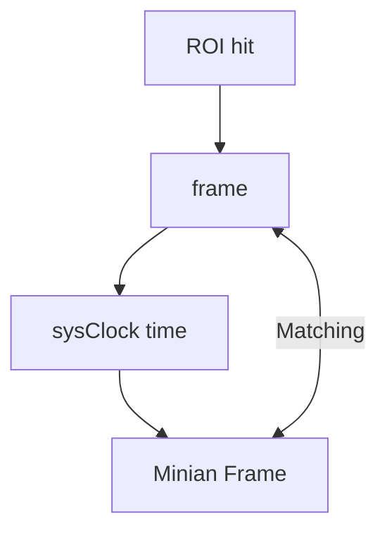

# Data cleaning pipeline (timestamping data + formatting)

This doc describes the “cleaning data” utilities in this workspace for working with the raw camera output. It prepares it to be used as a 'translation table' to look between the two respective dataframes of both  and Minian. 

Pipeline goals:

1. (Optional) Rename raw videos so  outputs sort chronologically.
2. Transpose `timestamp.dat` into a paired per-frame CSV to spot dropped frames.

The scripts for this live under the workspace root folder:

- `cleaning data/data names/`
- `cleaning data/timestamp conversion/`

## What you need

- Python environment with:
	- `pandas`, `numpy`

Install packages:

```bash
pip install pandas numpy
```

If you’re using a local venv on Windows, this pattern is usually safest:

```bash
cd "your/folder/location"
\.venv\Scripts\python.exe -m pip install pandas numpy
```

## Step 1 (optional) — Rename videos for chronological ordering

File: `cleaning data/ data names/names/_data_name.py`

Why this exists:

- The combining script sorts filenames alphabetically.
- If your videos / resulting filenames don’t sort chronologically, concatenation will be out-of-order. This will make it easier later on to match frames between the calcium imaging data and the  data. 

Since the later scripts will match frames using the following diagram:


>[!Important]
>It is super important to have a timestamped datafile, to be able to see the sysClock (or realtime-time), to be able to deal with framedrops. 

What it does:

- Looks for a date pattern in the folder name like `YYYYMMDD Tmaze`. You can change this to whatever format you have for your dating, as long as it is in the parent folder name.
- Prefixes each `.avi` with `MM-DD-` so alphabetical sorting matches recording order. You can also change this to your desired pattern, but keep in mind that in the later stages, it should end up chronological, or not if you wish to alter the code of later stages. 

Run it (example):

```bash
cd ".cleaning data\data name\names"
python data_name.py
```

Then edit the `folder_path` inside the script to your video folder, e.g.:

```python
folder_path = "your/folder/path"
```

>[!Note]
> This renames your original `.avi` files on disk. Only do this if you’re OK with filenames changing. I recommend copying your original videos to a folder so you do not lose the original copies. 


## Step 2 — Transpose `timestamp.dat` into paired camera rows

Script: `cleaning data/timestamp conversion/transpose_timestamps.py`

What it does:

- Reads a tab-separated `timestamp.dat` with columns:
	- `camNum`, `frameNum`, `sysClock`, `buffer` (Uses a timestamp.dat file, made during the trials.)
- Splits rows by camera (expects `camNum == 0` and `camNum == 2`). (Can be changed to match your own column-names)
- Builds a paired table by `frameNum`.
- Writes missing frames as `NaN` so dropped frames are obvious. (These empty frames will only be seen at the bottom of the table, because the camera counts its own frames, so only the total of frames might differ, hence the importance of a sysClock or realtime measurement.)

Run it:

```bash
cd ".\cleaning data\timestamp conversion"
python transpose_timestamps.py
```

Default input/output in the script:

```python
input_file = r'.\\timestamp.dat'
output_file = r'.\\timestamp_paired.csv'
```

Output:

- `timestamp_paired.csv`

## Quick checklist (common issues)

- Timestamps look wrong: confirm your `timestamp.dat` is tab-separated and includes cameras `0` and `2`.

