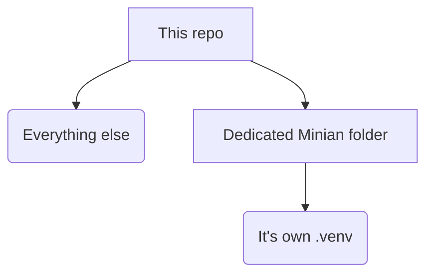

# Minian data conversion (Zarr → CSV → binarized traces, and plots)

This doc describes the small pipeline in this repo to:

1. Convert Minian output (`C.zarr`) into a wide CSV (`C.csv`) where each neuron/cell is a column.
2. Plot per-cell activity across frames.
3. Binarize calcium traces into 0/1 activity events.

Scripts live in: `Minian_data/scripts/`

## What you need

- A Minian output directory that contains `C.zarr`.
- Python environment with:
	- `xarray`, `zarr`
	- `pandas`, `numpy`
	- `matplotlib`
	- `scipy`

Install packages:

```bash
pip install xarray zarr pandas numpy matplotlib scipy
```
If that gives an error due to it not installing into the actual .venv. Use this instead (Recommended regardless) :
```bash
cd "your/folder/location"

.\.venv\Scripts\python.exe -m pip install xarray zarr pandas numpy matplotlib scipy
```

>[!Note]
> It is important you use a designated folder for the Minian install, so that the two virtual environments do not clash. 
i.e. 



## Folder expectations

All scripts take a “Minian output folder” (called `dpath` in code). That folder should contain `.zarr` outputs from Minian, especially:

- `C.zarr` (temporal activity; used for conversion)

Example in this workspace (from the repo tree):

- `Minian_data/scripts/minian/` contains multiple `*.zarr` including `C.zarr`.

## Prerequisite Minian output

>The `Minian_data/scripts/minian/` folder includes some test data, so you can test the functionality. None of the scripts will intervere with your own acquired data, but it is nice to use as an example case. 

For getting your own Minian data, you can refer to the [Minian Github page](https://github.com/denisecailab/minian). They have a lot of good documentation and a comprehensive guide to set up your own pipeline. 

Personally, I had some issues with the initial set-up using `conda install -y -c conda-forge minian`, This is due to Minian using a different python version, so be keen in checking you have the correct python version. I used `conda install python=3.8.1` for a matching version. Other than that the setup was straight-forward. 

> Keep in mind that Minian is quite heavy on CPU and RAM usage, so make sure you have adequate of each on your designated platform. And the `save_minian()` function can sometimes take a while to process, so be patient and it should resolve. 

Lastly, the Minian pipeline is very extensive with a lot of variables to tweak to make the most of your data. Make sure you read through all the text boxes, so you do not miss anything that might twist your results. 

## Step 1 — Convert `C.zarr` to `C.csv`

Script: `convert_to_csv.py`

What it does:

- Opens `C.zarr` with `xarray.open_zarr(..., consolidated=False)`.
- Converts to a long table, then pivots to wide format:
	- rows = `frame`
	- columns = `unit_id` (renamed to `cell_<unit_id>`)
- Writes `C.csv` into the same folder as `C.zarr`.

### Run it

By default, the script uses:

```python
param_save_minian = {"dpath": "./test videos/minian"}
```

That path is **relative to where you run the script**. If your Minian output is elsewhere, change `dpath` in the `__main__` block, change `"./test videos/minian"` to your own path or call the function from your own code. 

### Output

- `C.csv` in the Minian output folder (`dpath`).

`C.csv` columns look like:

- `frame`
- `cell_0`, `cell_1`, ... (one column per `unit_id`)

## Step 2 — Plot cell activity from `C.csv`

Script: `plotting.py`

What it does:

- Loads `C.csv`.
- Detects all columns except `frame`.
- Creates one subplot per cell and plots activity over frames.
- Saves a PDF called `Figure_1.pdf` next to the CSV.
> This again is the default name, and also again the default folder, which you can freely change. 


### Run it

It expects `C.csv` to exist at the path built from:

```python
param_save_minian = {"dpath": "../test videos/minian/"}
file_name = "C.csv"
```

If it prints `CSV file not found`, adjust `param_save_minian["dpath"]` to point to the folder where you created `C.csv`.

### Output

- `Figure_1.pdf` saved into the same folder as `C.csv`.

Note: if you have many cells, this figure will be very tall (one subplot per cell). You can change the matplotlib figures as you like to get your desired look and feel. 

The graph made from the test data in the `"./Minian_data/scripts/minian"` folder will produce the following graph:


Here you can see the calcium activity of the three found "seeds" through time. 

Minian adds all videos into one, assuming its the same animal, which we will account for in the default mode of this repo, however if this is not the case for you, make sure you seperate the videos before putting it through the pipeline. 


_work in progress_
## Step 3 — Binarize calcium traces (`C.csv` → `C_binary.csv` etc.)

Script: `bina_csv_data.py`

What it does:

- Reads the CSV.
- For each `cell_*` column:
	- Low-pass filters the trace (2nd order Butterworth, 2 Hz cutoff).
	- Normalizes by standard deviation (z-like normalization).
	- Computes the first derivative.
	- Sets cell values to 1 when `(normalized > z_threshold) AND (derivative > 0)`. Which can then be used to infer activity, for a more detailed explanation, refer to [this paper](https://www.frontiersin.org/journals/neural-circuits/articles/10.3389/fncir.2020.00019/full) by Etter and colleagues.

It returns four dataframes and saves them:

- `C_binary.csv`
- `C_filtered.csv`
- `C_normalized.csv`
- `C_derivative.csv`

### Parameters

- `SAMPLING_FREQUENCY` (default in script: `30`): frames/sec (Hz) of imaging.
- `Z_THRESHOLD` (default in script: `2.0`): threshold in SD units.

### Run it

Default paths inside the script:

```python
input_file = "../test videos/minian/C.csv"
output_dir = "../test videos/minian/"
```

Adjust those if your CSV is stored elsewhere.

### Output

Saved into `output_dir`:


## Quick checklist (common issues)

- `C.zarr not found`: confirm the folder you set in `dpath` actually contains `C.zarr`.
- `CSV file not found`: run `convert_to_csv.py` first, and check you’re pointing to the same output folder.
- Wrong binarization: double-check `SAMPLING_FREQUENCY` matches your acquisition FPS/Hz.

